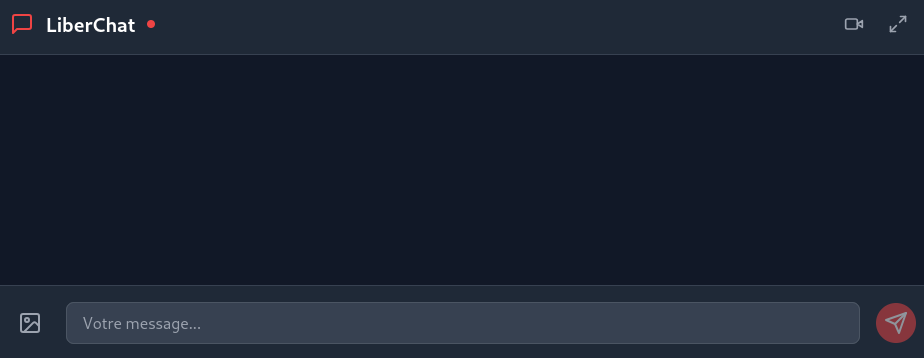

# LiberChat 🚩  

**LiberChat** est une application de messagerie instantanée libre et open source, conçue pour offrir un espace de communication sécurisé et militant. Cette plateforme met l'accent sur la liberté d'expression tout en respectant les valeurs de gauche et l'éthique du logiciel libre.  





---

## 🌟 Fonctionnalités  

- 💬 **Messagerie instantanée en temps réel**  
- 📸 **Partage d'images et de vidéos**  
- 📞 **Appels vidéo en temps réel avec WebRTC**  
- 👥 **Gestion des utilisateurs en temps réel**  
- 🔄 **Messages système** (connexion/déconnexion des utilisateurs)  
- 📱 **Interface responsive et adaptative**  
- 🖼️ **Mode plein écran pour les discussions**  
- 🧹 **Nettoyage automatique des fichiers après 24h**  
- 🔒 **Focus sur la sécurité et la confidentialité**  

---

## 🛠️ Technologies Utilisées  

### **Backend**  
- Node.js  
- Express.js  
- Socket.IO  
- Multer (gestion des fichiers uploadés)  
- PeerJS (gestion des appels vidéo)  

### **Frontend**  
- React.js  
- TypeScript  
- Tailwind CSS  
- PeerJS Client  
- Socket.IO Client  

---

## 📋 Prérequis  

- **Node.js** (v18.x ou supérieur)  
- **NPM** (inclus avec Node.js)  
- Un navigateur moderne prenant en charge WebRTC (comme Chrome ou Firefox)  

---

## 🚀 Installation  

1. **Clone le dépôt** :  
   ```bash
   git clone [https://github.com/AnARCHIS12/Liberchat-3.0.git]
   cd liberchat
   ```  

2. **Installe les dépendances** :  
   ```bash
   npm install
   ```  

3. **Démarre le serveur** :  
   ```bash
   node server.js
   ```  

4. **Accède à l'application dans ton navigateur** :  
   ```
   http://localhost:3000
   ```  

---

## 🔧 Configuration  

- Par défaut, le serveur démarre sur le port `3000`.  
  - **Pour modifier**, définis la variable d'environnement `PORT`.  
  - Alternativement, modifie la configuration dans `server.js`.  

- PeerJS fonctionne sur `/peerjs`. Assure-toi que ce chemin est accessible depuis ton réseau.

---

## 📁 Structure du Projet  

```plaintext
liberchat/
├── public/
│   ├── index.html     # Interface utilisateur
│   └── uploads/       # Dossier des fichiers uploadés
├── src/
│   ├── components/    # Composants React
│   ├── pages/         # Pages principales de l'application
│   └── utils/         # Fichiers utilitaires
├── server.js          # Serveur principal Node.js
└── package.json       # Dépendances et scripts NPM
```

---

## 🙌 Contribution  

Les contributions sont les bienvenues ! Si tu souhaites signaler un bug, proposer une fonctionnalité ou contribuer au code, n'hésite pas à ouvrir une **issue** ou une **pull request**.  

---

## 📜 Licence  

Ce projet est sous licence [GPLv3](https://www.gnu.org/licenses/gpl-3.0.fr.html).  
Fais-en bon usage et partage-le pour défendre la liberté d'expression !  
